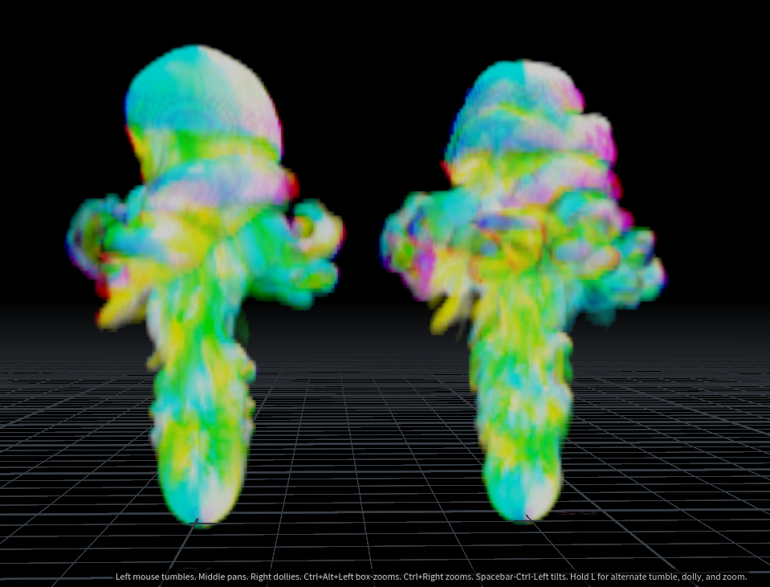
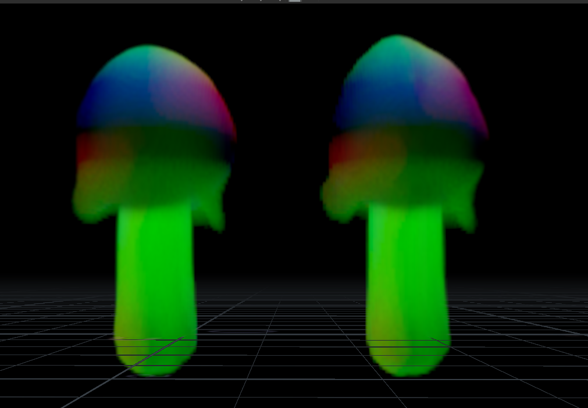
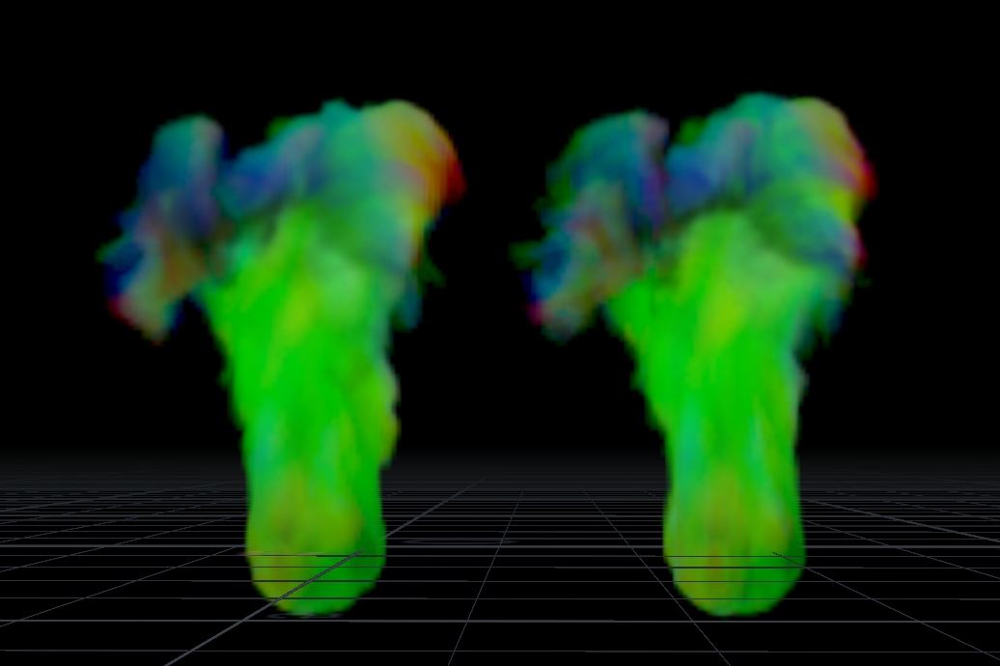
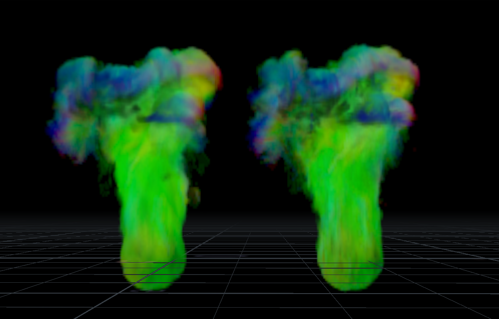

# Implementation of smoke simulation by BiMocq2 Algorithm in Houdini 

## Abstract

This is an implementation of the smoke fluid settlement based on theBiMocq2(2 levels of Bi-directionalmapping of convective quantities) method to obtain a more detailed, more precise and stable fluid sim-ulation.  This implementation is done using houdini so that Houdini users can easily apply it in theirdaily work.  This implementation is slightly different from the original paper.  The order of the algorithmsteps is slightly adjusted, and the final method of affecting the speed variable is changed to better fitHoudini’s original smoke simulation.
----

   
    The BiMocq2 method is implemented in Houdini mainly to get a more accurate solution with more details. From the results, the original setting is reached. The BiMocq2 method not only gets more details under the same conditions, which leads to the better visual richness, but also leads to more turbulence.

    It is a comparison between the Semi-Lagrangian method and the Bimocq2 method. It can be found that the difference between the two methods is not obvious without the influence of too many other factors. This is mainly because in this simple case, the fluid dissipation and error are small, and the difference between various algorithms is not too large.

     But the situation is different when other noise parameters are added. The Figure above is the result of adding some other parameters(disturbance turbulence) on the basis of the Semi-Lagrangian simulation. It can be found that BiMocq2 gives more credible details:

     In addition, the BiMocq2 method shows strong compatibility and can be applied with Houdini in-built fluid solution to get better results.
    From the Figure above, it can be found that MacCormack obtains better and more detailed calculation results than Semi-Lagrangian without changing all parameters, and BiMocq2 can add more credible details on the basis of MacCormack.

